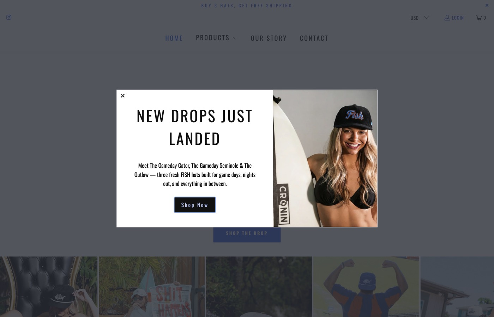
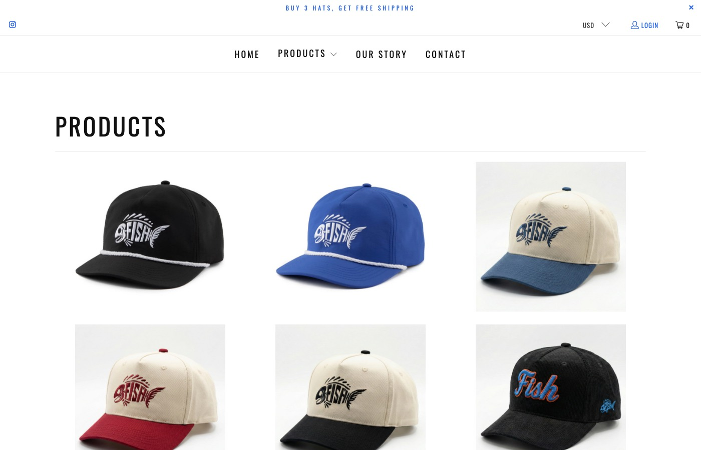
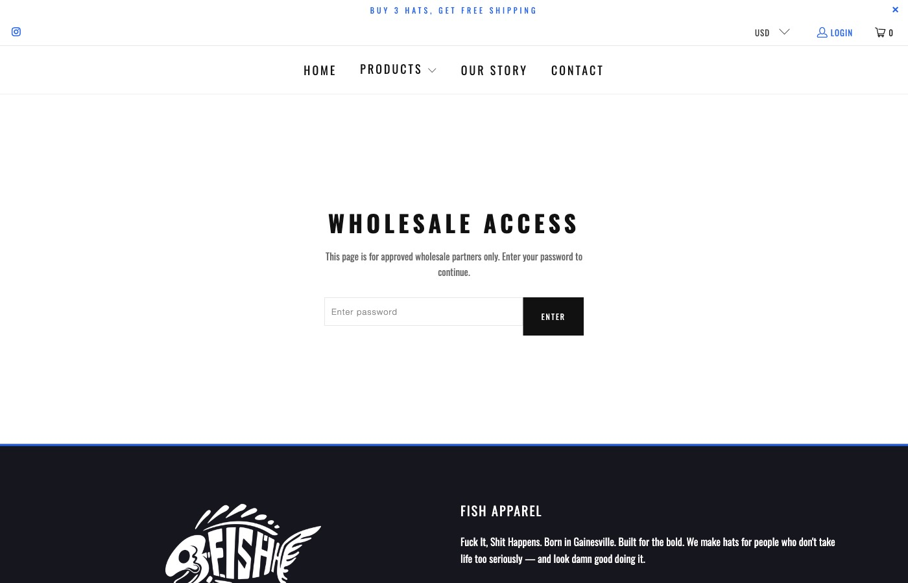

# FISH Apparel — A Full Business Revitalization

Took a college DTC hat brand from "paying for everything off the shelf" to a custom-engineered commercial surface — Shopify storefront, B2B wholesale system, brand collateral, and a 12-month growth plan. ~$1,500/year in paid Shopify extensions replaced with custom Liquid and JavaScript that ships with the theme.

> **Live site:** [fuckitshithappens.org](https://fuckitshithappens.org)

---

## The problem

FISH Apparel (acronym aside — *Fuck It, Shit Happens*) is a Gainesville-based college hat brand selling at retail and through wholesale partnerships with bars, marinas, and college nightlife venues. The brand had a Shopify store, a name, and momentum — but the business surface around it was being held together by a stack of paid Shopify apps and ad-hoc workarounds.

The specific problems:

- **The product gallery shipped wrong photos** for the selected color variant — a checkout-killer for a brand whose product variants are the entire pitch (Gator orange, Seminole garnet, etc.). The store was paying $14.90/month for a Shopify app to fix it.
- **No wholesale system.** B2B partners would email orders manually. There was no real catalog, no pricing structure, no contact flow.
- **Generic shipping copy, no AOV mechanic.** Customers had no visible incentive to add a third hat — even though the brand's economics work much better at the 3-hat threshold.
- **No coherent brand collateral.** Inconsistent business cards, no email signatures, no social media plan beyond posting whenever.
- **Product bios that read like dropdown options**, not like the brand's actual voice.

The brand needed less app subscriptions and more *infrastructure*. This was a rebuild of how the business operated commercially, not a redesign of how it looked.

## What we built

### 1. Custom Shopify storefront

A full storefront customization on top of the Turbo Seoul theme. All custom files prefixed with `fish-` to stay clean against future theme updates.

- **Variant image filtering** (`fish-variant-images.liquid`) — 160 lines of vanilla JS that hooks into the theme's Flickity gallery, reads image filenames, and re-orders the gallery in real time when a customer picks a color. Replaces the *SA Variant Image Automator* app at $14.90/month.
- **Infinite scroll photo gallery** — A smooth, seamless lifestyle-photo marquee using `requestAnimationFrame` to measure exact pixel widths and snap the loop. No CSS keyframe rounding errors, no white flash at the seam.
- **Free shipping progress bar** (`fish-shipping-progress.liquid`) — "Add X more hats for FREE SHIPPING" with a visible fill animation. Threshold set at 3 hats. Replaces the *Hextom Free Shipping Bar* premium tier at $9.99/month.
- **Quick Add to Cart on cart page** — Replaces the theme's default 3-click flow with a 1-click POST to `/cart/add.js`. Lifted impulse-purchase conversion on the cart page.
- **Scroll-aware sticky header** — Hides on scroll down, reappears on scroll up. More mobile real estate.
- **Custom mega menu with live product grid** — Pulls products directly from the relevant collection so the menu always shows current inventory.

### 2. B2B wholesale system

Built from scratch as a single Liquid section (`fish-wholesale.liquid`) — no Shopify app required. Retailers visit `/pages/wholesale`, enter a password (or scan a QR-coded business card with the password pre-filled as a URL param), and get a full wholesale catalog at 50% off retail.

- Quantity selectors per variant with real-time order totals
- Client-side SHA-256 hashing against a Shopify page metafield for password validation (the wholesale page isn't a checkout — it's a structured order form that emails the order to the brand)
- One-click access via QR-coded business cards
- Replaces wholesale apps like *Wholesale Pricing Discount B2B* ($24.99/month), *B2B Wholesale Hub* ($39/month), or *SparkLayer* ($49/month with a 50-order monthly cap)

### 3. Product bio rewrites

Rewrote every product bio in the brand's actual voice. Old copy read like Shopify variant labels ("Gator Orange Corduroy Hat — One Size — Adjustable"). New copy leads with character and ties each hat to its context (gamedays, beach days, late-night bars). Where the original copy was generic catalog filler, the rewrites match how FISH actually talks about itself.

### 4. Brand collateral

- **Business card system** — An interactive HTML designer with four design directions, toggleable between team members. Each card includes a QR code linking directly to the wholesale portal with the password pre-filled. Shipped with a complete printing guide covering CMYK specs, paper-stock recommendations, and a comparison of three printers we'd actually use.
- **Email signatures** — A branded Gmail-ready signature template using the brand fonts (Dosis), the cinnabar-equivalent accent color, and consistent contact-block formatting across the team.
- **OG / social preview image** — HTML template plus Puppeteer pipeline that generates a branded 1200×630 PNG for link previews on iMessage, Twitter, LinkedIn, and Slack.

### 5. Social media growth plan

A four-tab interactive HTML report covering:

- **Posting schedule** — Cadence and content mix across Instagram, TikTok, and other platforms
- **Ad budget allocation** — How to deploy a fixed monthly spend across acquisition vs. retargeting
- **Five UGC campaigns** — Tactical playbooks for user-generated content with real-world hooks (game-day reposts, marina partnerships, etc.)
- **AI content plan** — How to use Veo 3.1 and Nano Banana for video and image generation at small-brand scale
- **B2B partnership tracking** — Active partnerships with Collegiate Nightlife, Paul Davis, PORT 32 Marinas, and ongoing pipeline

### 6. Marketing infrastructure

- **Native newsletter capture** (`fish-newsletter-instagram.liquid`) — Dual-column homepage section with email signup on the left and Instagram CTA on the right. Uses Shopify's native contact form so signups go straight to the customer list. Replaces Klaviyo (~$30/month at 1,000 contacts) and Privy ($24–$45/month).

## Stack

| Layer | Technology |
|---|---|
| E-commerce platform | Shopify |
| Theme base | Turbo Seoul (Out of the Sandbox) |
| Templating | Liquid (~1.6MB custom) |
| Client code | Vanilla JavaScript (~500 lines across six snippets) |
| Styling | Custom CSS (2,200 lines, `fish-apparel.css`) |
| Type | Dosis (display) / Arial · Helvetica Neue (body) |
| Brand colors | Electric blue `#56bdec`, Dark `#16161d`, Gold `#c79f5c` |
| Auth (wholesale) | Client-side SHA-256 against a Shopify page metafield |
| OG image pipeline | HTML template + Puppeteer |

## Outcome

- **~$1,500/year in paid Shopify extensions replaced with custom code.** The store stopped paying for variant image filtering, wholesale apps, free-shipping bar apps, newsletter capture, and quick-add functionality — all replaced with custom Liquid and JS that ships with the theme. One-time engagement cost, permanent savings.
- **A working B2B channel where there wasn't one.** Wholesale partners now have a dedicated portal with structured ordering. Business cards carry QR codes that drop a retailer directly into the authenticated catalog. The B2B funnel didn't exist before this engagement.
- **AOV mechanic built into checkout.** The "Add X for free shipping" progress bar pushes customers toward the 3-hat threshold where the brand's economics work best.
- **A coherent commercial identity.** Business cards, email signatures, and social-media collateral now read as one brand instead of a stack of one-off Canva files.
- **A growth plan that's actually written down.** The social-media strategy report and B2B partnership tracker mean the team has a shared answer to "what are we doing next?" rather than improvising weekly.

## Screenshots

*Home page. Lifestyle gallery uses the custom infinite-scroll marquee; "BUY 3 HATS, GET FREE SHIPPING" announcement bar drives toward the free-shipping threshold.*

*Products collection page. Custom mega menu (live product grid) and the brand's color palette are visible across the layout.*

*Wholesale portal landing. Password-protected catalog reachable directly from QR codes on the partner business cards.*

## Timeline & engagement shape

- **Duration**: Under a month, end to end
- **Engagement type**: Fixed-price
- **Deliverables**: Custom Shopify storefront, B2B wholesale system, product bio rewrites, business card system + printing guide, email signatures, OG / social preview pipeline, four-tab social media growth plan
- **Status**: Shipped — live at [fuckitshithappens.org](https://fuckitshithappens.org). Custom code is maintained under the `fish-` prefix and survives theme updates.

---

*Built by [Ad Rem](https://adrem.services). For engagement inquiries: [hello@adrem.services](mailto:hello@adrem.services) or [book a call](https://cal.com/ad-rem/30min).*
